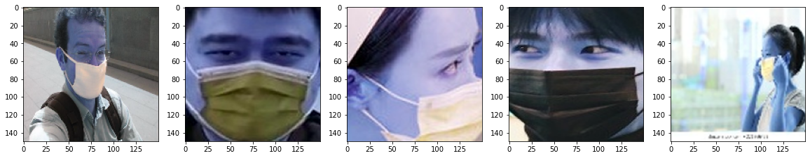
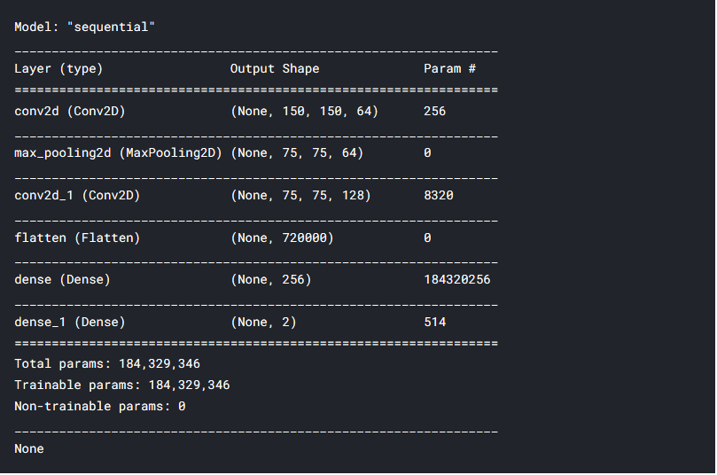
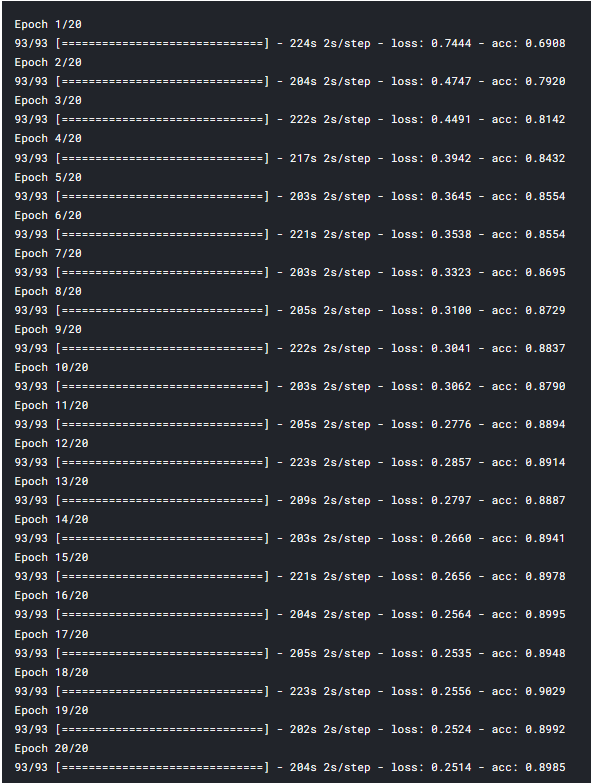
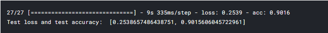
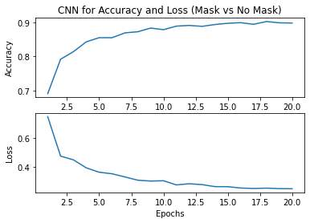
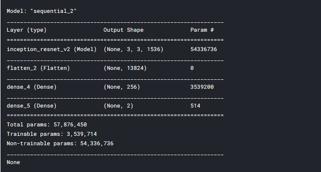
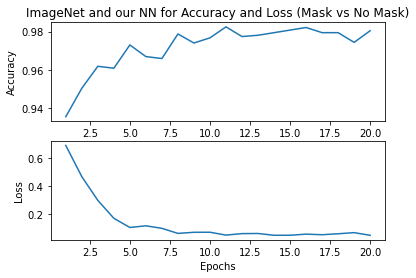

# Mask Recognition using CNN and Transfer Learning
## Implementing CNN for a basic image classification

The main goal of this project is to give an introduction to utilizing Keras library for building a basic Convolutional Neural Network. A comparison is done between the RProp and Adam optimizers is done on the same network.

## Implementing transfer learning using the InceptionResNetV2 model
As a secondary goal I wished to highlight transfer learning using ImageNet as an example for improving a neural networks performance. Image processing, splitting testing/training data, and basic plotting of model performance will also be highlighted here.

## Method:
### Basic CNNs
First all the necessary data and libraries are imported. The CV2 library is for data processing and resizing of the images. Examples of the processed images are shown below:

Next the models are built, trained and evaluated for accuracy.

Matplotlib is used to visualize the results of the loss and accuracy over time for each epoch:

### Transfer learning
Utilizing the InceptionResNetV2 model the same process is done and results are compared:

Please see the file CNN_Transfer_Learning_Mask.py to view the full code.

For a more detailed description of this project please visit the Kaggle notebook at https://www.kaggle.com/dbsimpson/basic-cnn-and-transfer-learning
